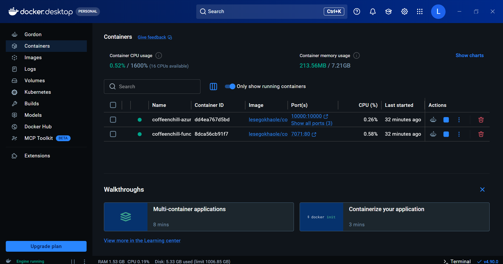
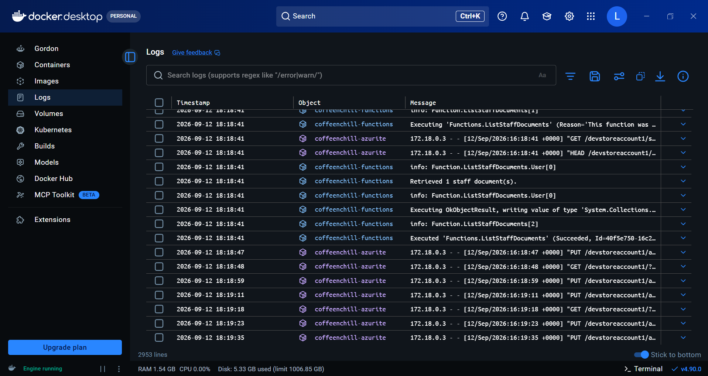
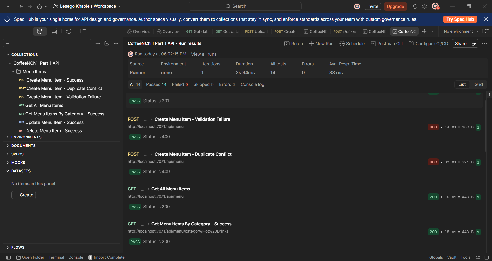
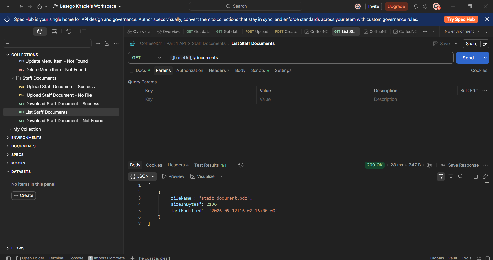
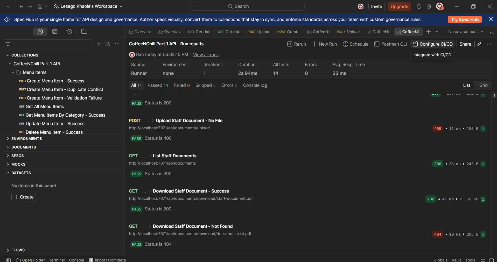

# CoffeeNChill Canteen Management System

CoffeeNChill is a cloud-enabled canteen-management microservices project for CLDV6212
Cloud Development B. This Part 1 deliverable provides a .NET 8 Azure Functions API for
managing menu items in Azure Table Storage and staff documents in Azure Blob Storage. The
system will be extended incrementally in Parts 2 and 3.

## Table of Contents

- [Architecture Overview](#architecture-overview)
- [Prerequisites](#prerequisites)
- [Local Setup and Run](#local-setup-and-run)
- [API Reference](#api-reference)
- [Docker](#docker)
- [Testing](#testing)
- [Evidence Screenshots](#evidence-screenshots)
- [Repository Structure](#repository-structure)
- [Team and Contributions](#team-and-contributions)
- [AI Use Disclosure](#ai-use-disclosure)
- [Demo Video](#demo-video)
- [Known Limitations and Part 2 Preview](#known-limitations-and-part-2-preview)

## Architecture Overview

Clients use HTTP endpoints exposed by Azure Functions. Menu records are stored in the
`MenuItems` Azure Table, while staff-document metadata and content are managed through
the `staff-docs` Azure Blob container. Docker packages the Functions host; Azurite supplies
local Table and Blob Storage emulation for the complete Part 1 workflow.

```text
Postman / Web Client
        |
        v
Azure Functions HTTP API (.NET 8)
   |                         |
   v                         v
MenuItems Azure Table      staff-docs Blob container
   |                         |
   +------ Azurite (local Table and Blob emulator) ------+
                              |
                           Docker
```

## Prerequisites

- .NET SDK 8.0
- Azure Functions Core Tools v4
- Docker Desktop
- Azurite, through Docker or npm, for local Table and Blob Storage emulation
- Postman

## Local Setup and Run

1. Clone the repository and open the `CoffeeAndChill` project folder.
2. Copy `local.settings.template.json` to `local.settings.json`. The real local settings
   file is ignored by Git and must not be committed.
3. Restore and build:

   ```powershell
   dotnet restore
   dotnet build
   ```

4. Run Azurite for Table and Blob Storage:

   ```powershell
   docker run --rm --name coffeenchill-azurite -p 10000:10000 -p 10001:10001 -p 10002:10002 mcr.microsoft.com/azure-storage/azurite
   ```

5. Start the Functions app:

   ```powershell
   func start
   ```

6. Import `docs/PostmanCollection.json` into Postman and run it against
   `http://localhost:7071/api`.

`UseDevelopmentStorage=true` lets every Part 1 endpoint use local Azurite. The official
Part 1 addendum requires Azure Blob Storage rather than Azure File Shares because Azurite
emulates Blob Storage locally. No Azure subscription or real cloud connection string is
required for the Part 1 test workflow.

## API Reference

| Method | Route | Description | Sample body |
|---|---|---|---|
| POST | `/api/menu` | Creates a menu item. | `{ "category": "Hot Drinks", "sku": "COF-001", "name": "Espresso", "description": "Single shot espresso", "price": 25.00, "isAvailable": true }` |
| GET | `/api/menu` | Returns all menu items as an array. | - |
| GET | `/api/menu/category/{category}` | Returns items in a category as an array. | - |
| PUT | `/api/menu/{category}/{sku}` | Updates an existing menu item. | `{ "name": "Double Espresso", "description": "Two shots", "price": 35.00, "isAvailable": true }` |
| DELETE | `/api/menu/{category}/{sku}` | Deletes a menu item. | - |
| POST | `/api/documents/upload` | Uploads an allowed PDF, Word, PNG, or JPEG staff document. | `multipart/form-data`, field `file` |
| GET | `/api/documents` | Lists staff documents. | - |
| GET | `/api/documents/download/{fileName}` | Downloads a staff document. | - |

## Docker

Part 1 uses two standalone containers connected through `coffeenchill-net`; Docker
Compose is intentionally not used. See [docs/DOCKER_COMMANDS.md](docs/DOCKER_COMMANDS.md)
for the complete build, run, publish, pull, and troubleshooting commands.

The final public image repositories will be [Functions](https://hub.docker.com/r/lesegokhaole/coffeenchill-functions)
and [Azurite](https://hub.docker.com/r/lesegokhaole/coffeenchill-azurite).

## Testing

Import [docs/PostmanCollection.json](docs/PostmanCollection.json) into Postman. Its
collection-level `baseUrl` variable defaults to `http://localhost:7071/api`; change it
only if your host and port differ. The collection exercises all eight endpoints with the
specified success and failure scenarios. Attach a small permitted document to the upload
success request, then set the matching file name in the download-success request.

Use [docs/API_TEST_MATRIX.md](docs/API_TEST_MATRIX.md) for the ordered live-test plan and
[docs/PART1_QA_EVIDENCE.md](docs/PART1_QA_EVIDENCE.md) to record the proof needed before
submission.

## Evidence Screenshots

The screenshots below are final-state proof that the standalone Docker environment, the
Azurite integration, and the Postman test suite all work end to end. They are supporting
evidence for the repository and the demo video; they do not replace the video or the
Docker Hub links, which remain the primary required proof for submission. The image files
live in [docs/evidence/](docs/evidence/).

### 1. Standalone Docker containers running



Docker Desktop showing the two containers running independently, `coffeenchill-azurite`
and `coffeenchill-functions`, with no Docker Compose involved. The Functions `7071:80`
port mapping and the Azurite port bindings are both visible.

### 2. Azurite and Functions Docker logs



Docker logs showing `coffeenchill-functions` handling a `ListStaffDocuments` request while
`coffeenchill-azurite` receives the matching storage operations, confirming that the
Functions API is actually talking to local Azurite Blob Storage rather than mocking it.

### 3. Full Postman collection passing



The Postman Collection Runner reporting **All 14, Passed 14, Failed 0, Skipped 0, Errors
0**, confirming that the committed collection covers every required Menu and Staff
Document endpoint and that all saved tests pass together in one run.

### 4. Document list returned from Azurite Blob Storage



`GET /api/documents` returning `200 OK` and listing `staff-document.pdf` with its size and
last-modified time, confirming the document was stored and retrieved correctly through the
Azure Blob Storage implementation.

### 5. Staff document workflow passing



The runner covering the Staff Documents workflow end to end: the no-file upload error
case, the document listing, a successful download, and the missing-file `404` response —
all passing.

## Repository Structure

```text
CoffeeAndChill/
|- Functions/
|  |- Menu/
|  |  |- CreateMenuItemsFunction.cs
|  |  |- GetAllMenuItemsFunction.cs
|  |  |- GetMenuItemsByCategoryFunction.cs
|  |  |- UpdateMenuItemsFunction.cs
|  |  `- DeleteMenuItemsFunction.cs
|  `- Documents/
|     |- UploadStaffDocument.cs
|     |- ListStaffDocuments.cs
|     `- DownloadStaffDocument.cs
|- Models/
|- DTOs/
|- Interfaces/
|- Services/
|- docs/
|  |- PostmanCollection.json
|  |- DOCKER_COMMANDS.md
|  `- evidence/
|     |- 01_Docker_Standalone_Containers_Running.png
|     |- 02_Azurite_and_Functions_Docker_Logs.png
|     |- 03_Postman_All_14_Tests_Passed.png
|     |- 04_Azurite_Blob_Document_List_200_OK.png
|     `- 05_Postman_Document_Workflow_Passed.png
|- Dockerfile
|- .dockerignore
|- .gitignore
|- host.json
|- local.settings.template.json
|- CoffeeAndChill.csproj
`- README.md
```

## Team and Contributions

| Name | Student Number | Part 1 Role | What they owned |
|---|---|---|---|
| Lesego Khaole | ST10455441 | Project Manager, QA, Documentation & Delivery | Postman collection and test coverage, `/docs`, README, final integration testing, and evidence coordination. |
| Happy Van Der Merwe (Joseph) | ST10482408 | Data & Menu | `Functions/Menu/`, the `MenuItems` model, Azure Table Storage service, and all five Menu HTTP Functions. |
| Kamva Setheni | ST10447340 | Documents | `Functions/Documents/`, `staff-docs` Azure Blob Storage integration, and all three Document HTTP Functions. |
| Lehlogonolo Ntshabeleng (Hlogi) | ST10474988 | Containers & Infrastructure | Dockerfile, `.dockerignore`, Docker networking, and Docker Hub publishing. |

Lesego Khaole leads the Part 1 QA, documentation, Postman coverage, and integration
evidence. Happy Van Der Merwe (Joseph) owns the Menu data model, storage layer, and Menu
functions. Kamva Setheni owns staff-document storage and its API endpoints. Lehlogonolo
Ntshabeleng (Hlogi) owns the container workflow and Docker Hub images.

## AI Use Disclosure

AI coding assistants, were used for debugging support, code
review suggestions, integration fixes, and role assignment and responsibility clarifiction. The team reviews.

## Demo Video

**Video:** [Unlisted YouTube link - to be added before submission]

## Known Limitations and Part 2 Preview

Part 1 intentionally excludes Docker Compose, queues, and authentication. The official
Part 1 addendum replaces Azure File Shares with Azure Blob Storage, allowing all Part 1
document tests to run locally through Azurite. Part 2 and Part 3 will introduce the
remaining distributed workflows and security capabilities.
